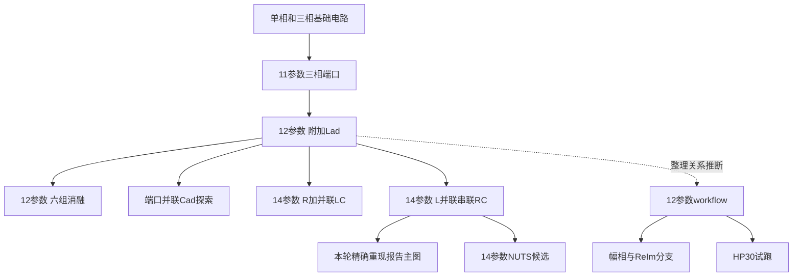

# Model Evolution — evidence-led working history

> 2026-10-06 更新：已收到11项人工回答，见[人工回答整合](HUMAN_REVIEW_INTEGRATION.md)。下文原调查文字保留；涉及人工意图与待回答状态时，以本次整合说明为准。

**当前工作定位：** 12参数是作者认可的稳定基线；14参数 L∥(R+C) 暂称最新实验候选，尚未定稿。nLls 为有意经验调整，解析解释未闭合。工况回答属推测，保持 UNKNOWN。报告用于研究背景参考，不代表冻结版本。

日期：2026-10-05。所有箭头表示工作假设中的关系，不表示研究者已确认的决策。未指定canonical。

## 可确认的模型家族

| 调查标签 | 端口/拓扑 | 代表文件 | 证据状态 |
|---|---|---|---|
| M0-single | 单相配置、11参数 | [Circuit_Fitting/exp_1_fit.py](</D:/Desktop/LinkCodex/Circuit_Fitting/exp_1_fit.py>) | CONFIRMED，与同为11参数的三相模型不能混同 |
| M1 | exp10三相化简，11参数，无附加支路 | [Circuit_Fitting/exp_10_fit.py](</D:/Desktop/LinkCodex/Circuit_Fitting/exp_10_fit.py>)、[baselines/CurVer_no_L.py](</D:/Desktop/LinkCodex/baselines/CurVer_no_L.py>) | CONFIRMED |
| M2 | M1核心+1.5jωLad，12参数 | [baselines/CurVer.py](</D:/Desktop/LinkCodex/baselines/CurVer.py>)、[baseline1/CurVer.py](</D:/Desktop/LinkCodex/baseline1/CurVer.py>) | CONFIRMED；六组消融属此家族 |
| M2-shunt | 加Lad后在测量端并Cad | ee0a7f1:tmp/tmp.py，保存于evidence | CONFIRMED存在，实际报告用途UNKNOWN |
| M3-Rseries | 每相R+(L∥C)，14参数 | [tmp/tmp.py](</D:/Desktop/LinkCodex/tmp/tmp.py:214>)、tmp1–3 | CONFIRMED存在，报告正文同类拓扑 |
| M3-RCparallel | 每相L∥(R+C)，14参数 | [try/try.py](</D:/Desktop/LinkCodex/try/try.py:147>)、try2、NUTSVerTry | CONFIRMED可复现主图/历史曲线 |
| W2 | M2+模块化提取/拟合/验证 | [baseline1/workflow/run_workflow.py](</D:/Desktop/LinkCodex/baseline1/workflow/run_workflow.py>) | CONFIRMED仍12参数；不是M3自动化版 |
| W2-ReIm / W2-magphase | 相同12参数电路，残差实验分支 | experimental_reim_workflow / mag_phase_workflow | CONFIRMED；前者本身不是与原CurVer不同的ReIm创新 |
| W2-HP30 | 换AP_30输入，保留默认先验 | [baseline1/hp30_workflow/fitting.py](</D:/Desktop/LinkCodex/baseline1/hp30_workflow/fitting.py:90>) | CONFIRMED试跑；有效性未确认 |

关系/意图总体MEDIUM confidence。两种14参数并不等价；不能把它们合并为唯一V3。

## 时间证据（Git入库时间，不等于编写时间）

| 事件 | 可确认内容 | 可推断与限制 |
|---|---|---|
| ac82e9a 2025-10-14 | 初始提交已有Csf/Llr/fr_fa、参考论文及figure1.m | 最早仓库材料，不代表研究起点 |
| 4a21dfa 2026-01-12 | exp_10_fit、Ztotal_result.csv等进入；旧MATLAB文件删除 | 当前Python主体不能抹去更早绘图历史 |
| 1月组会材料 | 讨论eta异常、Cad位置尝试、支路遮蔽、小附加电感 | 内容支持探索分支，但文件名日期不单独证明执行时间 |
| 9cf0d55 2026-02-09 | baselines/CurVer、IniVer、NUTSVer进入；CurVer是纯Lad版 | M2至少当时已归档 |
| ee0a7f1 2026-03-11 | Anly/GA/No-L及其他比较；tmp有端口并联Cad | 优化与拓扑探索并行 |
| fc8ad7f 2026-03-28 | baseline1六组消融及3月27日日志；tmp为R+(L∥C) | 12参数benchmark与14参数实验同时存在 |
| 44cd9ba 2026-05-27 | try/try、try2、NUTSVerTry及PaperFigure进入 | 后一拓扑首次可见入库；不能断言五月才开发 |
| 当前未提交工作树 | workflow/MD/report未跟踪，CurVer改为import initial_params | clean workflow的意图/创建日仍需人工确认 |

来源：[完整本地 Git 路径历史](</C:/Users/35789/Documents/ChatGPT/LinkCodex/Phase2A_audit/evidence/git_history.txt>)、[evidence/git_diff.txt](</C:/Users/35789/Documents/ChatGPT/LinkCodex/Phase2A_audit/evidence/git_diff.txt>)、[像素、AST、数据质量与历史拓扑记录](</C:/Users/35789/Documents/ChatGPT/LinkCodex/Phase2A_audit/checks/supplemental_results.json>)。报告封面April2026与五月入库不构成造假证据；有延迟归档的合理替代解释。

## 本轮最合理历史解释

**HIGH：** 无附加支路→附加纯电感→多种端口修正方案确实共存；12参数用于已保存消融，14参数L∥(R+C)能重现主结果。报告热图是12参数，主图是可复现的14参数输出。

**MEDIUM：** 作者很可能将多个开发阶段汇入报告，正文留有R+(L∥C)文字；后来workflow围绕稳定的12参数baseline整理。没有证据说明作者正式否定14参数或指定12参数最终canonical。

**LOW/UNKNOWN：** 每次改版的确切动机、正式提交报告日期、最终采用决策、原始仪器边界。应由HUMAN_REVIEW确认并回查证据。

**This is a working hypothesis, not a confirmed conclusion.**

若出现早期workflow快照、正式回退说明、或与图绑定的另一套运行记录，需修订相应箭头；不删除现有分支。
